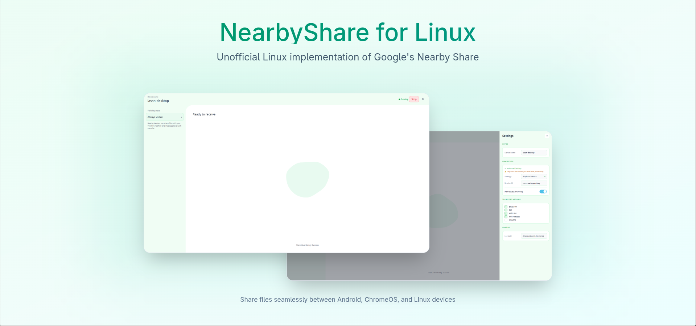

# Google Nearby Sharing & Connections for Linux (Unofficial)

> **P2P file sharing, device discovery, and wireless connectivity on Linux** — powered by Google Nearby protocols.



An unofficial Linux implementation of [Google Nearby](https://developers.google.com/nearby), forked from the official Nearby codebase. This project brings **Nearby Connections**, **Nearby Sharing (Quick Share)**, and **Nearby Presence** to Linux, enabling file transfer and device discovery between **Linux and Android** (and Linux to Linux) over Bluetooth, Wi-Fi LAN, Wi-Fi Direct, and more.

> **Status:** Work in progress — known bugs exist. Contributions and bug reports are welcome.

**Motivation:** Google has multiple Linux implementation PRs open but they have not been merged into the official repo. This is an actively maintained Linux-focused fork.

> - 📖 Nearby wiki: https://github.com/kidfromjupiter/nearby/wiki

If you spot bugs, help identifying them is appreciated. Filing issues is always welcome. If you want to contribute, please start a discussion about the guidance you need.

Bazel is a terrible build system when it does not work and a pretty good one when it does. There is no in-between. The source code is unwieldy and it took me months to understand what everything does and where things go. It does not help that this is how I decided I am going to learn C++. Blessed be my naive soul.

## Installation

1. Go to the [Releases page](https://github.com/kidfromjupiter/nearby/releases) and download the latest `.tar.gz` archive.
2. Extract the archive:
   ```shell
   tar -xzf nearby-linux-*.tar.gz
   ```
3. Run the executable inside the `bin/` directory of the extracted folder:
   ```shell
   ./bin/nearby_sharing
   ```

## Android Companion App

To **share files from Android to Linux**, you need the Android companion app **shareby**:

👉 **https://github.com/kidfromjupiter/shareby**

Install the app on your Android device, then run the Linux sharing service (see [Installation](#installation) above) on your Linux machine to receive files.

## Testing status

I have tested with various setups:

- Android walkie-talkie example app detects and connects over Bluetooth Classic and Wi-Fi LAN and can share data. ~~Medium upgrade is untested or unclear.~~
- Linux to Linux sharing can be tested extensively so I can control the advertising and discovery environment.
- I do not have access to the Android implementation details.
- If you enable Quick Share visibility to Everyone on Android and run `sharing/linux` in advertising mode, it appears as a target in the Quick Share menu (promising, but not a full end-to-end validation).

#### What is tested

- Linux to Linux sharing: advertising, discovery, and data work over Wi-Fi Direct, Wi-Fi Hotspot, Wi-Fi LAN, and Bluetooth Classic.
- BLE advertising and discovery work, but without a data medium.
- GATT advertising and discovery work.
- Android to Linux Nearby Connections work for the same mediums as Linux to Linux above (Bluetooth Classic, Wi-Fi LAN, Wi-Fi Hotspot, Wi-Fi Direct). Testing used https://github.com/kidfromjupiter/nearby-connections-android, which exposes the full Nearby Connections API on Android.
- Connection initiation succeeds in both directions (Android -> Linux and Linux -> Android) when using the Nearby Connections example apps on Android and Linux. Quick Share still fails.

#### What is not tested or unknown

- Android to Linux Nearby Sharing with Quick Share end-to-end; current status is that it fails during the Quick Share connecting stage.

Debugging tip: when investigating Quick Share failures on Android, this helps:

```shell
adb logcat | grep -Ei 'NearbySharing|NearbyConnections|NeabyMediums'
```

## Known issues

### Android to Linux Quick Share connection failure

Observed Android log output when initiating a share from Android to Linux:

```
I NearbySharing: [NS_AUTH] send-side ConnectionFailure
01-21 10:49:27.180 24952 14785 I NearbySharing: [ClearcutLog] ESTABLISH_CONNECTION sessionId=8906741495577782802 status: 5 shareTarget: ShareTarget<version: 1, id: 14, deviceName: NoName, fullName: null, imageUri: null, type: LAPTOP, fileAttachmentSize: 0, unredactedFileAttachmentSize: 0, textAttachmentSize: 0, wifiCredentialsAttachmentSize 0, appAttachmentSize: 0, streamAttachmentSize: 0, folderAttachmentSize: 0, isKnown: false, isIncoming: false, groupName: null, action: null, isExternal: false, deviceId: null, hasSharedAccount: false, useCase: 0, modelName: null, isOutgoingQrCodeMatching: false, isSharingOverCloud: false, vendorId: 0> referrer: null durationMillis: 21556
01-21 10:49:27.181 24952 14355 I NearbySharing: NearbySharing Internal event ConnectFailed(endpointId=NN28, failure=AUTH_FAILURE)
```

This suggests Android to Linux sharing may require reverse engineering Android Nearby Sharing authentication.

### Wi-Fi Hotspot upgrade failure on Android to Linux

When initiating a connection from Android to Linux, the Wi-Fi Hotspot medium upgrade currently fails.

This is not an officially supported Google product.

## Features

- **Nearby Connections** — Low-level P2P communication API (advertising, discovery, data transfer)
- **Nearby Sharing** — File and text sharing compatible with Android Quick Share
- **Nearby Presence** — Device presence detection and discovery

## Linux platform support

The Linux platform implementation provides abstraction layers over local networking and Bluetooth hardware to support Nearby radio operations. The current Linux implementation supports:

### Supported mediums (Linux)

<table>
  <thead>
    <tr>
      <th align="left" colspan="2">Legend</th>
    </tr>
  </thead>
  <tbody>
    <tr>
      <td><ul><li>[x] </li></ul></td>
      <td>Supported.</td>
    </tr>
    <tr>
      <td><ul><li>[ ] </li></ul></td>
      <td>Support is possible, but not implemented.</td>
    </tr>
    <tr>
      <td></td>
      <td>Support is not possible or does not make sense.</td>
    </tr>
  </tbody>
</table>

| Mediums           | Advertising            | Scanning               | Data                   |
| :---------------- | :--------------------: | :--------------------: | :--------------------: |
| Bluetooth Classic | <ul><li>[x] </li></ul> | <ul><li>[x] </li></ul> | <ul><li>[x] </li></ul> |
| BLE (Fast)        |                        | <ul><li>[x] </li></ul> |                        |
| BLE (GATT)        | <ul><li>[x] </li></ul> | <ul><li>[x] </li></ul> |                        |
| BLE (Extended)    | <ul><li>[x] </li></ul> | <ul><li>[x] </li></ul> |                        |
| BLE (L2CAP)       |                        |                        |                        |
| Wi-Fi LAN         | <ul><li>[x] </li></ul> | <ul><li>[x] </li></ul> | <ul><li>[x] </li></ul> |
| Wi-Fi Hotspot     |                        |                        | <ul><li>[x] </li></ul> |
| Wi-Fi Direct      |                        |                        | <ul><li>[x] </li></ul> |
| Wi-Fi Aware       |                        |                        |                        |
| WebRTC            |                        |                        |                        |
| NFC               |                        |                        |                        |
| USB               |                        |                        |                        |
| AWDL              |                        |                        |                        |

Note: BLE fast advertising is not supported on Linux because Android uses separate LE random/resolvable MAC addresses per advertisement, and Linux does not currently support that. The Linux implementation uses BLE Extended advertising instead.

## Example Applications

- **Linux Nearby Sharing service:** `sharing/linux`
- **Nearby Connections examples:**
  - Walkie-talkie: `nearby/connection/walkietalkie`
  - File share: `nearby/connections/file_share`
- **Android Nearby Connections example app** (full API exposure): https://github.com/kidfromjupiter/nearby-connections-android
- **Android → Linux file sharing companion app (shareby):** https://github.com/kidfromjupiter/shareby

## Contributing

General contribution guidelines are in `CONTRIBUTING.md`.

If you are working on the Linux platform, start with `LINUX_CONTRIBUTING.md`.

## License

Nearby is released under the `LICENSE`.
